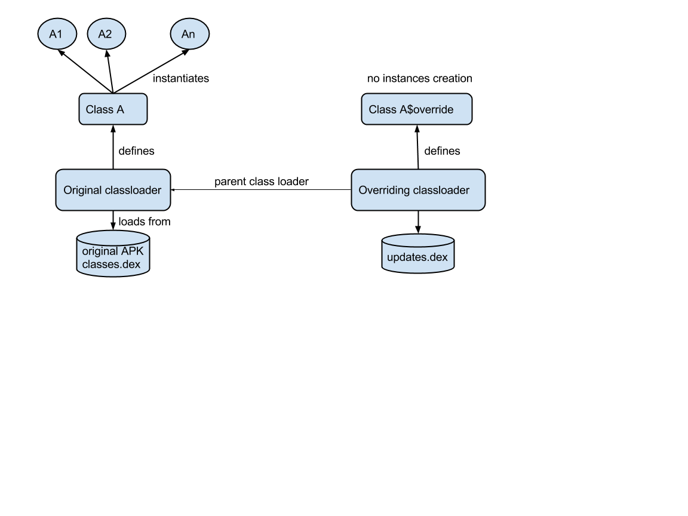

[Instant Run](/instant-run/README.md) > **Instant Run Hot Swap**

# Instant Run Hot Swap

This is the instrumentation for instant run hot swap.

## Background

Since one of the objective of the solution was to run on older versions of
Android (down to ICS), it was not considered to provide a solution which would
require a modified Runtime Environment like a modified Virtual Machine that
would support technologies like --javaagent on the JDK which allow for class
reloading.

Any solution based on loading an alternate version of the same class using a
different class loader would cause insolvable issues like :

 * Classes identity in the Java language is the fully qualified class name
   (package+simple class name) + class loader that loaded the class. So the same
   fully qualified class name loaded by two different class loaders are two
   different Java types causing ClassCastException if mixed.
 * Instances of the original type cannot be morphed into instances of the
   updated type, while new instances would be of the new type, creating once
   again mix and match exceptions.

Therefore the solution had to respect the constraints of the Java language
memory model and typing :
 1. Classes cannot be reloaded.
 2. Instances of a class must always all be from the same type even if that
    class implementation is updated.
 3. Instances of the updated classes cannot exist (as type references might have
    already been resolved by the JVM).

The solution is deceptively simple : never consider a class outdated, all
instances of its FQCN (fully qualified class name) are all from the original
class type. If a class is updated, all its methods implementations are
redirected to the new implementation.

In other words, once a class is loaded, all the instances of that class will be
from this unique FQCN+class loader. Once that class is updated, it becomes an
empty shell (retaining the fields values) redirecting every method call to the
new implementation.

For this to work, the original class must be prepared to be potentially updated
(so it can delegate all its method implementations to the new version). The
updated version must be also prepared to be able to receive all the redirected
method calls. Let’s take an example to see how this may work :

```
package com.google.android.foo;


public class A {
    int intField;


    public int someMethod() {
        return intField;
    }
}
```

In order to prepare this class to be updatable, we enhance it to:

```
package com.google.android.foo;


public class A {
    static IncrementalChange $change = null;
    int intField;


    public int someMethod() {
         if ($change != null) {
            return $change.access$dispatch("someMethod_()I", this)
           }
      return intField;
    }
}
```

As you can see, as long as the override static field is not set, the behavior of
the class is unchanged (except for a small performance hit introduced by the
if() test. This is the class that will be delivered in the initial APK.

Now say the user changes the implementation of the class A, the build-system
makes necessary enhancements to the class to become the new implementation of
the original class. Since the new implementation will never be instantiated, we
can safely remove all its instance or static fields. We can also transform all
its methods as static methods.

Following on the original example, say the use changed the implementation of
someMethod:

```
package com.google.android.foo;


public class A {
    int intField;


    public int someMethod() {
        return intField*2;
    }
}
```

The build-system will enhance this class (through bytecode manipulation since it is acting of the compile class) to the following :

```
package com.google.android.foo;


public class A$Override implements Dispatch {


    public static int someMethod(A sender) {
        return sender.intField*2;
    }


    public static Object dispatch(A sender, String methodName, String signature) {
        if (methodName.equals("someMethod")) {
            return someMethod(sender);
        }
    }
}
```

Now all you have to do is wire up the A$Override class to the original A class
$change field. This can be done at runtime, using a new class loader to load the
A$Override class called the overriding class loader. The parent class loader of
that class loader will be the A class’ original class loader so A$override can
also have visibility on A type and all objects A can access.  This is how it
looks like at run time :



## Supported changes

For the moment, the implementation of Hot Swap supports changing any method
implementation (constructor, static and instance methods), structural changes
(like adding/removing a method, changing the class hierarchy, changing the
static initializer).

Two types of instrumentation must happen. Initial instrumentation is aimed at
making the class hot swappable while the incremental instrumentation will
prepare the class so it can replace at runtime a class that was prepared during
the initial instrumentation.

### Initial Instrumentation

The initial instrumentation will take care of preparing a class to be
potentially updated during the lifecycle of the Virtual Machine. It is important
that any overhead introduced by this ability be minimized as it may impact every
method or every class of the application.

### Making method updatable ###

When a method is overridden, the $change value is set to the current $Override
class overriding the original class. Now each method invocation need to be
redirected to the new implementation passing all the original parameters and
returning the result for non void method.

So during the initial instrumentation, all static and instances methods are
enhanced with following pseudo-code provided a java.lang.Method object reference
on the method being instrumented.

```
if ($change != null) {
    Object[] parameters = new Object[method.getTypeParameters().length];
    parameters[0] = this;
    for (int i=0; i < method.getTypeParameters().length; i++) {
        parameters[i] = box(argsI);
    }
    Object res = $change.access$dispatch(method.signature, parameters);
    if (method.getReturnType != Void) {
        return unbox(res);
    }
}
```

### Making constructor updatable ###

Building on the same idea, the constructors can be instrumented so new
implementation when available can be used. However there are a few complications
to take care of :

1. The uninitialized this cannot escape the constructor until `super.<init>` is
   called.
2. Only constructor code can call `super.<init>`, this call cannot be moved to
   another class.
3. Some code can be present in the bytecode before `super.<init>` call when users
   have code like : `super.A(Utils.myStaticMethod(“a”, “b”), 2+3).`


Therefore, we had to split the constructor calls into 3 phases:

1. Pre `super.<init>` phase which will contain all the code necessary to build
   the argument list that will be used for the super constructor invocation.
2. `super.<init>` call with arguments obtained from the phase1.
3. Follow up code passed the `super.<init>` call (note that it is OK to have
   “this” escape the constructor in that phase.

Let’s take an example :

```
    Public A(int i, int j, String str) {
        super(Utils.getContext(), i*j, str);
        this.intField = i;
    }
```

Therefore the pseudo code to support live updates will look like :

```
public A(int i) {
    Dispatch localChange = $change;
    If (localChange != null) {
        Object[] args = new Object[];
        args[0] = args;     // so init$args implementation can change
        // the super parameter values.
        args[1] = box(i);
        localChange.init$args(args);
        // push back arguments on the stack from the args as the
        // init$args function may have changed it.
        a = args[1];
        b = args[2];
        c = args[3];
    } else {
        a = Utils.getContext();
        b = i*j;
        c = str
    }
    super.<init>(a, b, c);
    if (localChange != null) {
        Object[] args = new Object[2];
        Args[0] = this;
        Args[1] = box(i);
        localChange.init$body(args);
        return;
    }
    this.intField = i;
}
````

### Super invocations. ###

Super invocations also requires special handling. The issue is that the Virtual
Machine verifier will check that any invokespecial to a super method is made by
code residing in a subclass of the class containing the target method.

Furthermore, using reflection will not help. Even if one looks up the method
reference on the super class and invokes it, the underlying code generated will
actually do an invokevirtual on the object instance you pass. The invokevirtual
will therefore invoke the object instance’s class method rather than the super
class like anticipated.

To work around that issue, we generate a trampoline method in class that will be
updatable called access$super() that will provide access to the super method of
that class. All we have left to do is to transform any super.method call into a
call to the access$super() when doing incremental transformation.

The trampoline method pseudo code :

```
Object access$super(String name, object[] args) {
  switch(name) {
    "firstMethod.(Ljava/lang/String;Ljava/lang/Object;)Ljava/lang/Object;":
         return super.firstMethod((String)arg[0], arg[1]);
    "secondMethod.(Ljava/lang/String;I)V":
         return super.secondMethod((String)arg[0], (int)arg[1]);
    default:
           Throw new InstantRunException("... not found");
  }
}
```


## Bytecode instrumentation ##

### Initial instrumentation ###

Instrumentation is done by an ASM Java bytecode visitor that will perform the
following changes to the class :

1. Add a Dispatcher `$change` static field.
2. Make all non private methods public so they can be called by the `$override`
   class without overly relying on reflection.
3. Change all methods implementation to check if a new version has been
   registered in the `$change` field and dispatch the method call to the
   Dispatcher implementation it there is one registered.
4. Make all non private fields public so they can be accessed from the
   `$override` class without overly relying on reflection.
5. Write the `access$super` method (details below)
6. Write the `access$constructor` method (details below)

### Incremental Instrumentation ###

A$Override creation is achieved by an ASM Java bytecode visitor introducing the following changes :

1. Remove all constructors and fields declaration, they will never be used since
   no instances of the $Override classes will ever be created.
2. Make all methods static (no instance).
3. Write the Dispatcher method implementation
4. Make all private fields go through reflection on the original object.
5. Make all private methods calls call directly the $Override.method
